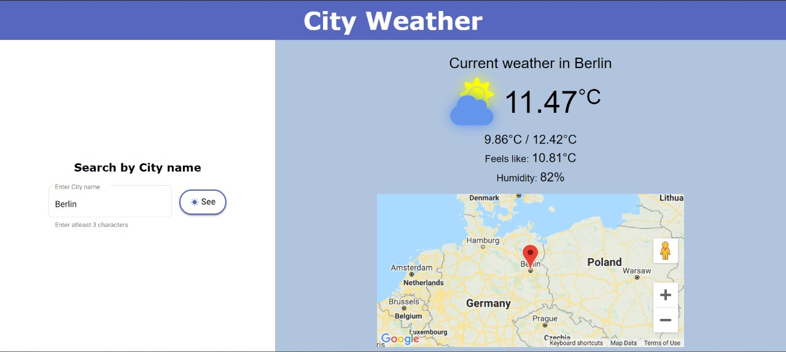

# WeatherInCity

The goal of this application is to view the Weather using a Open Source Weather API.

## Basic implementation

The application

- Is an Angular application allowing the user to see the weather in a specified city.
- Allows the user to select a city using an input.
- Shows the weather details provided by the [OpenWeatherMap](https://openweathermap.org/current) API.
- Handles all possible API's erros by showing relevant error messages.
- Updates the weather every ten seconds for the selected city.
- Retains the last selected city upon refresh and shows its current weather details.
- Uses Behavior subjects to detect any change in the state.
- Is built to be responsive across multiple devices including mobiles.

## Additional implementation

The application

- Provides a typeahead input for displaying auto suggestion of cities.
- Shows the geographical position of the selected city or location in google maps.
- Enables the user to view their current location's weather if the location access is provided.
- Allows the user to select a location on the map to view the weather of that selected location.
- Is built and deployed with the help of github pages and is available at - https://divyabharathimanimaran.github.io/WeatherInCity.
- Includes necessary test cases with nearly 70% coverage.

## Application

## Test coverage report

## Project

This project was generated with [Angular CLI](https://github.com/angular/angular-cli) version 12.1.1.

## Development server

Run `ng serve` for a dev server. Navigate to `http://localhost:4200/`. The app will automatically reload if you change any of the source files.

## Code scaffolding

Run `ng generate component component-name` to generate a new component. You can also use `ng generate directive|pipe|service|class|guard|interface|enum|module`.

## Build

Run `ng build` to build the project. The build artifacts will be stored in the `dist/` directory.

## Running unit tests

Run `ng test` to execute the unit tests via [Karma](https://karma-runner.github.io).
